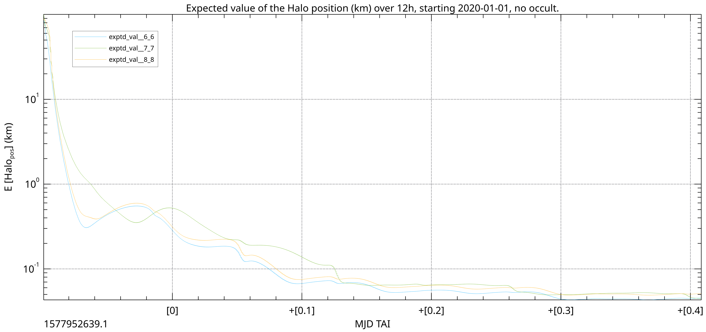
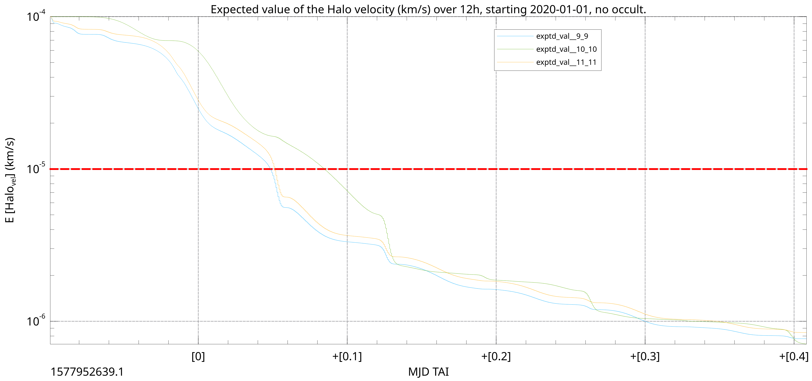

# nyx
[Nyx](https://en.wikipedia.org/wiki/Nyx) is a high fidelity, fast, reliable and **[validated](./VALIDATION.md)** astrodynamical toolkit library written in Rust.

The target audience is researchers and astrodynamics engineers. The rationale for using Rust is to allow for very fast computations, guaranteed thread safety,
and portability to all platforms supported by [Rust](https://forge.rust-lang.org/platform-support.html).

[![nyx-space on crates.io][cratesio-image]][cratesio]
[![nyx-space on docs.rs][docsrs-image]][docsrs]

[cratesio-image]: https://img.shields.io/crates/v/nyx-space.svg
[cratesio]: https://crates.io/crates/nyx-space
[docsrs-image]: https://docs.rs/nyx-space/badge.svg
[docsrs]: https://docs.rs/nyx-space/

# License
The [LICENSE](./LICENSE) will be strictly enforced once this toolkit reaches production-level quality.

# Features
- [x] Propagation with different Runge Kutta methods (validated in GMAT)
- [x] Convenient and explicit definition of the dynamics for a simulation (cf. [tests/orbitaldyn.rs](tests/orbitaldyn.rs))
- [x] Orbital state manipulation (from GMAT source code and validated in GMAT) (cf. [tests/state.rs](tests/state.rs))
- [x] Statistical Orbit Determination: Classical and Extended Kalman Filter (cf. [tests/stat_od/two_body.rs](tests/stat_od/two_body.rs))
- [x] Multibody dynamics using XB files (caveat: [#61](https://gitlab.com/chrisrabotin/nyx/issues/61)) (cf. [tests/orbitaldyn.rs](tests/orbitaldyn.rs))
- [x] Orbit Determination with multibody dynamics (cf. [tests/stat_od/multi_body.rs](tests/stat_od/multi_body.rs))
- [x] Finite burns with fuel depletion (including low thrust / ion propulsion) (cf. [tests/prop/](tests/prop/))
- [x] Sub-Optimal Control of continuous thrust (e.g. Ruggerio, Petropoulos/Q-law) (cf. [tests/prop/closedloop_multi_oe_ruggiero.rs](tests/prop/closedloop_multi_oe_ruggiero.rs))
- [x] Planetary and Solar eclipse and visibility computation (cf. [tests/eclipse.rs](tests/eclipse.rs))
- [x] Solar radiation pressure modeling (cf. [tests/srp.rs](tests/srp.rs))
- [ ] Propagation to different stopping conditions
- [ ] Spherical harmonics
- [ ] Basic drag models
- [ ] Light-time corrections and abberations
- [ ] Spacecraft attitude control and some useful optimal control algorithms
- [ ] Monte Carlo simulations on different parameters
- [ ] Link budget computations

_Note:_ Some of these features may only be made available only through a commercial license in the future.

# Who am I?
An astrodynamics engineer with a heavy background in software. Nyx relies on the fallbacks of
[smd](https://github.com/ChristopherRabotin/smd), a library I wrote in Go while researching at the University
of Colorado at Boulder. I work for Advanced Space ([we do really cool stuff](http://advanced-space.com/)).

# Examples
Refer to the tests for short examples.

## Exporting states to a CSV file
Refer to the test `qlaw_as_ruggiero_case_f` in `tests/prop/closedloop_multi_oe_ruggiero.rs`.

Or just run it as:
`cargo test qlaw_as_ruggiero_case_f --release -- --nocapture`

And check the file called `rugg_case_f.csv`

## Orbital Determination - Estimation plots of a Halo orbit using a classical Kalman filter
**Note:** the Kalman Filtering capabilities have been validated against JPL Monte using a proprietary scenario.

Data to recreate this simulation is deliberately not shared. This just provides an example of what is possible using this library.

